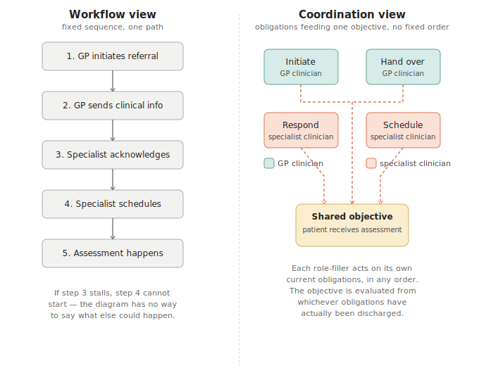
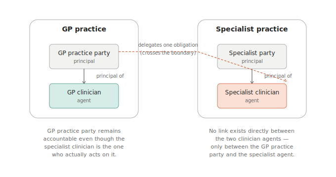

# From Workflow to Coordination: A Worked Example

## The idea, in one sentence

A traditional workflow tells you the *sequence* of steps. This approach
instead gives every participant — human or AI — a set of obligations and
permissions tied to a shared objective, and lets them act on their own
initiative; an engine evaluates each action against the current state,
and we can formally ask, at any point, "how well is this objective being
met?"

## The scenario

A GP refers a patient to a specialist for assessment. Rather than
specifying "step 1, step 2, step 3," the referral is modelled as a
**community of role-fillers**, each holding obligations and permissions
relevant to one shared objective.

> **The objective: the patient receives a consented specialist
> assessment.**

Everything below — every obligation, every check, every score — exists
in service of that one objective. It's worth keeping in view throughout.

The role-fillers ("active enterprise objects," or ActiveEOs) involved:

- **A GP clinician** — initiates the referral, hands over clinical
  information.
- **A specialist clinician** — responds to the referral, schedules the
  assessment.

Neither role-filler has to be human. The specialist clinician role, in
particular, could equally be filled by an AI agent acting on the
practice's behalf — an AI triage or scheduling assistant, say. The
framework doesn't distinguish: it tracks what gets *done* (an obligation
discharged, a permission exercised), not who or what did it. That's
deliberate — it's precisely what makes this approach useful once AI
agents are genuine participants, since an AI agent's internal reasoning
can be opaque even to the people who built it. What's formally tractable
is its observable behaviour, not its reasoning.

Each role-filler's obligations ("burdens," formally):

| Obligation | Role-filler | How important | Must it definitely happen? |
|---|---|---|---|
| Initiate the referral | GP clinician | Critical | Yes — strictly enforced |
| Hand over clinical info | GP clinician | Normal | Eventually, not guaranteed |
| Respond to the referral | Specialist clinician | High | Eventually, not guaranteed |
| Schedule the assessment | Specialist clinician | Normal | Eventually, not guaranteed |

The "how important" column isn't just descriptive — each level (Critical,
High, Normal, or Low, on a fixed scale) directly feeds the priority-
weighted score described later in this note. A Critical obligation
carries more weight in that score than a Normal one, so a problem with a
Critical obligation pulls the score down further than an equally bad
problem with a Normal one would. This is what lets the score reflect
which obligations actually matter most, rather than treating every
obligation as equally important.

It's worth seeing the structural difference directly. A traditional
process diagram would draw this as a fixed sequence — step 1, then step
2, then step 3, and so on, each one blocking the next. That is not how
this is actually modelled:

In the left-hand picture, if step 3 stalls, the diagram has nothing
further to say. In the right-hand picture, all four obligations simply
feed the same shared objective, with no order declared between them at
all — which is also a more honest description of how a real referral
actually proceeds in practice, and a more natural fit once one of the
role-fillers is an AI agent acting on its own initiative rather than
following a hand-coded sequence.

The interesting design point about the last two: both have to happen —
scheduling an assessment for a referral that was never acknowledged
doesn't make clinical sense, and vice versa. (The model was initially
built with the two treated as interchangeable — either one alone counted
as "done" — and that mismatch was caught by asking exactly this kind of
question. A useful reminder that a model can run and produce sensible-
looking numbers while still encoding the wrong real-world relationship.)
So there's no shortcut: the objective is only met once both obligations
have genuinely been discharged.

(Behind the scenes, the GP side and specialist side also happen to sit in
two different organisations, with their own accountability structure —
who answers to whom if something goes wrong. That detail matters a great
deal for *governance* questions, much less for the coordination story
below, so it's set aside here and picked up separately.)

## What we wanted to check

Two different, complementary questions:

1. **Governance question** — "Is the referral process *guaranteed* to
   work, or could it fail?" A strict yes/no check, done *before* anything
   runs, at design time.
2. **Coordination question** — "Right now, mid-process, how well is the
   objective actually being met?" A priority-weighted score, not a yes/no
   answer — useful *while* the process is in motion — closer to a live
   dashboard than a pass/fail certificate.

Both questions are answered the same way: by walking through every way
the process could possibly unfold from the specification alone — a
branching tree of "what could happen next," generated automatically, not
hand-written. For this scenario, that tree has **102 distinct possible
situations** ("worlds") the process could be in.

## Result 1 — the governance check: guaranteed vs. merely possible

Recall the objective: *the patient receives a consented specialist
assessment.* This check asks whether each obligation feeding into that
objective is guaranteed to happen, or merely possible.

For the GP clinician's own obligation (initiate the referral), the
answer is **yes, guaranteed** — every possible path through the process
ends with it being done. That's because whoever wrote this specification
chose to mark this particular obligation **strict**: a deliberate policy
decision, not something inherent to how GPs work, that this specific
step shouldn't be allowed to sit undone indefinitely while the GP
clinician is available to act on it. It's a reasonable thing to insist
on here specifically, since referral initiation is the one step nothing
downstream can happen without — there's no recovering from a referral
that's simply never sent, the way a delayed handover or a delayed
response can still potentially be chased up. Mechanically, marking it
strict rules out every "kept deferring and never got to it" path from
existing at all, so the guarantee holds automatically, just from how the
obligation is written.

The other three obligations in this scenario were instead left
**eventual** by whoever wrote the specification — still real and active,
but the responsible party is allowed to delay rather than being forced
to act the moment they're able to. That's the more realistic default for
most obligations, and the spec author's choice not to apply it here is
exactly what creates the next, more interesting result.

For the specialist clinician's response, the answer is more interesting:
**not guaranteed, but always possible.** There exist paths where the
specialist keeps deferring and the obligation lapses — but there also
exist paths where it gets handled. This gap between "always possible"
and "always guaranteed" is a core formal finding of this work: simply
*assigning* a responsibility to someone doesn't *compel* them to act on
it — unless it's explicitly marked strict, the way the GP clinician's
own obligation is. A governance framework needs to know the difference —
and this is exactly where the accountability structure mentioned above
(who's ultimately answerable) starts to matter.

## Result 2 — the coordination check: a live quality score

Recall the objective again: *the patient receives a consented specialist
assessment.* This check asks not yes/no, but how well things are
actually progressing toward it, right now.

This is the coordination piece. Rather than just yes/no, we built a
function that gives a single number between −1 (everything's gone wrong)
and +1 (everything's gone right), scoped specifically to *this
objective's own role-fillers* — not diluted by anything else happening
elsewhere in the model.

Four concrete situations, pulled from the actual model:

**Early days — both specialist obligations still open.**
Score: **+0.3**. Nothing's gone wrong, nothing's resolved yet — a modest,
honest "in progress" reading, driven purely by the specialist clinician
not having acted yet.

**The specialist clinician completes both steps; the objective is met.**
In one real, concretely reachable situation, the specialist clinician
both responds to the referral and schedules the assessment. Score:
**+1.0** — the maximum, and the genuinely satisfied case: not "one step
happened so the other was excused," but both obligations actually
discharged. This is the coordination story made concrete: no orchestrator
told the specialist clinician to do these two things in a particular
order, or even confirmed both were done — the engine recognised, from the
specialist clinician's own actions alone, that the objective's actual
requirements were met.

**Something's gone wrong — and scoping it correctly matters.**
If the specialist clinician's response is missed (violated) while the
other specialist obligation hasn't even started, the objective-scoped
score reads **−0.6** — clearly bad. But if you instead asked the
*unscoped* version of this question — averaging across *every*
obligation tracked anywhere in the model — you'd have gotten **−0.13**,
a much milder-looking number. The reason: the GP side's own two
obligations (initiating the referral, handing over clinical info) happen
to still be sitting fine in this situation, and one of them — initiating
the referral — carries Critical weight. Averaged in with the specialist
side's problems, that unrelated GP-side activity pulls the overall number
most of the way back toward neutral, quietly hiding how badly *this*
objective is actually doing. This is exactly why scoping the question to
the objective's own role-fillers matters: an unscoped, system-wide
average can mask a real local problem, and the more heavily-weighted the
unrelated activity is, the more it can mask.

**Something going right is recognised as right, not just "not yet wrong."**
The +1.0 score above isn't a default or an absence of problems — it's an
actively recognised, fully achieved outcome, computed the same way
regardless of which specific real-world situation produces it.

## Why this matters

Put together, these two results tell a complete story: the governance
question tells you *whether a guarantee exists at all* (and where it
doesn't — assignment without compulsion); the coordination question
tells you *how things are actually going, right now, for the objective
you care about* — driven by the role-fillers' own actions and the
engine's evaluation of them, not by a hand-written sequence of steps, and
not diluted by unrelated activity elsewhere. Neither replaces the other.
The governance check is what you'd run before deploying the process; the
coordination score is what you'd want live, while the role-fillers —
human or AI — are actually doing the work.

This matters more, not less, once an AI agent is one of the
participants. A human clinician can be asked why they did or didn't act;
an AI agent's reasoning may not be inspectable at all, and even when it
is, that's not something the rest of the system can or should rely on.
What this approach offers instead is a way to reason about an AI agent's
*behaviour* — and how that behaviour drives progress toward a shared
objective — formally and in advance, without needing to trust or
understand its internal decision-making. The same obligations, the same
guarantees, and the same live coordination signal apply whether a role
is filled by a person or a machine.

## What's been added since: three things an agent can actually ask

Everything above describes what's *computable* about this scenario. The
next question is practical: how would an actual role-filler — a person
checking a dashboard, or an AI agent acting on its own initiative —
actually get at that information, in the moment, while the referral is
in progress? Three small, focused questions turn out to cover this, and
each is now something a system can be asked directly and answered
immediately, rather than something a person would have to work out by
hand.

**"What am I actually free to do right now?"** Ask this about the
specialist clinician at any point, and you get back a precise answer:
which actions are currently required (an obligation demands it, with
its deadline), and which are currently allowed (a permission grants it,
nothing currently blocks it) — not a vague sense of "what's next," but
an exact, checkable list grounded in the clinician's actual current
holdings. Ask the same question about the GP practice itself — the
organisation accountable for the referral overall, but not the one
holding the day-to-day tokens — and you correctly get back an empty
list: being accountable for an outcome and being the one who currently
has something to do are different facts, and the system doesn't
conflate them.

**"Can the objective still be reached from here?"** This is a yes/no
check, run fresh against wherever the process currently stands — not
against where it started. It's a deliberately weaker question than "is
it *guaranteed*" (that's the strict governance check from earlier in
this note); this one just asks whether at least one path to success
still exists. Asked of a community with no declared objective at all
(the GP side of this scenario, as it happens, doesn't have one), the
system is careful to say so explicitly, rather than quietly returning
"no" and letting that be mistaken for "the objective failed."

**"How well is it going, right now?"** This is the live score from
earlier in this note, now available as something you can simply ask
for, on demand, for any community in the scenario — not just computed
once as an illustration. Early in the process it reads a modest +0.3;
once both specialist obligations are genuinely discharged, it reads the
maximum +1.0; and it correctly returns "not applicable" rather than a
misleading zero for a community with nothing to score.

## What's still missing: knowing *what to do first*

All three of the above describe the *current* situation. None of them
answer a fourth, different question: if a role-filler has more than one
obligation open at once, *which one should they act on first* to make
the best possible progress overall — not just right now, but accounting
for everything that follows from the choice?

This is where a more advanced piece of machinery, now also built and
verified, comes in. Rather than scoring the present moment, it scores
every possible next action by the best achievable outcome of *everything
that action leads to*, with actions further in the future weighted
slightly less than ones happening sooner — the same intuition behind
preferring "good now" over "maybe good eventually." Run against this
scenario, it correctly recommends: don't wait. With nothing currently
blocking the GP clinician's or specialist's obligations, the optimal
recommendation is to act on all of them immediately, since any deferral
is calculated to be strictly worse than acting now. The one obligation
genuinely outside either clinician's immediate control — scheduling the
assessment, which depends on a separate availability check — correctly
shows up as something the model has to wait out, not something it can
optimise away.

This piece is more involved to verify than the three questions above,
and it surfaces a genuinely interesting technical subtlety worth
mentioning even at this level: the same obligation can sometimes be
discharged "instantly," without any time passing in the model, while
other transitions genuinely represent the clock ticking forward. Working
out how to fairly compare a path with several instant actions against a
path that waits was a real design decision, made explicitly rather than
left as an accident of the code — worth knowing this kind of judgment
call exists, even without needing the technical detail behind it here.

---

*A point worth flagging, though it's not central to the story above: the
links from each obligation to the objective in a diagram like this are a
real causal claim, just a narrower one than it might look. When one of
the specialist clinician's obligations actually discharges, that's
precisely what causes the objective's computed status to change — there's
no extra step in between. What it is **not** is one obligation causing
another. Nothing here makes responding to the referral trigger the
scheduling step, or vice versa; the two are evaluated independently, and
the framework does have a separate mechanism for that kind of
trigger-style causality when it's actually needed elsewhere. Worth
knowing the difference if you're reading the diagram closely: the arrows
mean "feeds into the objective's evaluation," not "sets off the next
obligation."*

*A note on what's deliberately left out here: this scenario also spans
two separate organisations (the GP practice and the specialist
practice), each with their own internal accountability structure — who's
ultimately responsible if something goes wrong, traced back through
delegation and organisational authority. That structure is real,
implemented, and verified, but it's a governance/accountability question
in its own right, fairly separate from the coordination story above. Ask
if you'd like that side of it walked through as well.*

*For internal reference only — not part of the story for a first read,
and not yet refined into a presentation-ready model: the diagram below
sketches the actual accountability wiring behind this scenario as it's
currently built. It's included here mainly so this work isn't lost
between sessions, and as a known-imperfect starting point for a more
carefully designed version later, once a richer scenario is built
specifically to demonstrate organisational structure to an architect
audience.*

